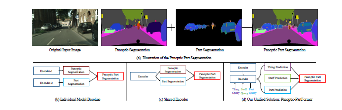
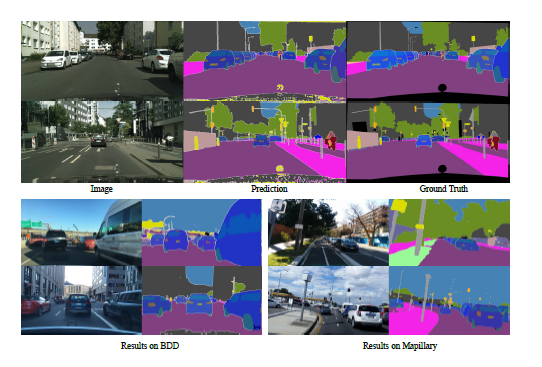

# PanopticPartFormer ECCV-2022

## Introduction


Panoptic Part Segmentation (PPS) aims to unify panoptic
segmentation and part segmentation into one task. Previous work mainly
utilizes separated approaches to handle thing, stuff, and part predictions
individually without performing any shared computation and task association.
In this work, we aim to unify these tasks at the architectural
level, designing the first end-to-end unified method named Panoptic-
PartFormer. 

We model things, stuff, and part as object queries and directly
learn to optimize the all three predictions as unified mask prediction
and classification problem. We design a decoupled decoder to
generate part feature and thing/stuff feature respectively

## Installation

It requires the following OpenMMLab packages:

- MMCV-full == v1.3.18
- MMDetection == v2.18.0
- panopticapi

The packages that in the requirement.txt file.

## Usage

### Data preparation

The basic data formats are as following:

Prepare data following [MMDetection](https://github.com/open-mmlab/mmdetection). 
The data structure looks like below:

For Cityscapes Panoptic Part (CPP) and PascalContext Panoptic Part (PPP) dataset:

```
data/
├── VOCdevkit # pascal context part dataset 
│   ├── gt_panoptic
│   ├── labels_57part
│   ├── VOC2010
│   │   ├── JPEGImages
├── cityscapes # cityscape pascal part dataset 
│   ├── annotations
│   │   ├── cityscapes_panoptic_{train,val}.json
│   │   ├── instancesonly_filtered_gtFine_{train,val}.json
│   │   ├── val_images.json
│   ├── gtFine
│   ├── gtFinePanopticParts
│   ├── leftImg8bit
```
### Pretrained Models:

#### Cityscapes Pretrained Model
R-50: [link]()

Swin-base: [link]()

#### Pascal Context Pretrained Model on COCO

R-50: [link]()

R-101: [link]()

Swin-base: [link]()


### Trained Models

### CPP

Swin-base [link]()

### PPP

Swin-base [link]()


### Training and testing
for single machine with multi gpus. 
To reproduce the performance.
Make sure you have loaded the ckpt correctly. 

```bash
# train
sh ./tools/dist_train.sh $CONFIG $NUM_GPU

# test
sh ./tools/dist_test.sh $CONFIG $CHECKPOINT --eval panoptic part

```
for multi machines, we use *slurm*

```bash
sh ./tools/slurm_train.sh $PARTITION $JOB_NAME $CONFIG $WORK_DIR

sh ./tools/slurm_test.sh $PARTITION $JOB_NAME $CONFIG $CHECKPOINT --eval panoptic, part
```

- PARTITION: the slurm partition you are using
- CHECKPOINT: the path of the checkpoint downloaded from our model zoo or trained by yourself
- WORK_DIR: the working directory to save configs, logs, and checkpoints
- CONFIG: the config files under the directory `configs/`
- JOB_NAME: the name of the job that are necessary for slurm

You can also run training and testing without slurm by directly mim for instance/semantic segmentation or `tools/train.py` for panoptic segmentation like below:

### Demo Visualization
for cityscapes panoptic part
```bash
python demo/image_demo.py $IMG_FILE $CONFIG $CHECKPOING $OUT_FILE
```
for pascal panoptic part
```bash
python demo/image_demo.py $IMG_FILE $CONFIG $CHECKPOING $OUT_FILE --datasetspec_path=$1 --evalspec_path=$2
```

### Visual Results



### Acknowledgement

We build our codebase based on K-Net and mmdetection. Much thanks for their open-sourced code.
Mainly refer to the implementation of thing/stuff kernels (query) interaction part. 


### Citation
If you find this repo is useful for your research, Please consider citing our paper:

```
@article{li2022panoptic,
  title={Panoptic-partformer: Learning a unified model for panoptic part segmentation},
  author={Li, Xiangtai and Xu, Shilin and Cheng, Yibo Yang and Tong, Yunhai and Tao, Dacheng and others},
  journal={ECCV},
  year={2022}
}
```
